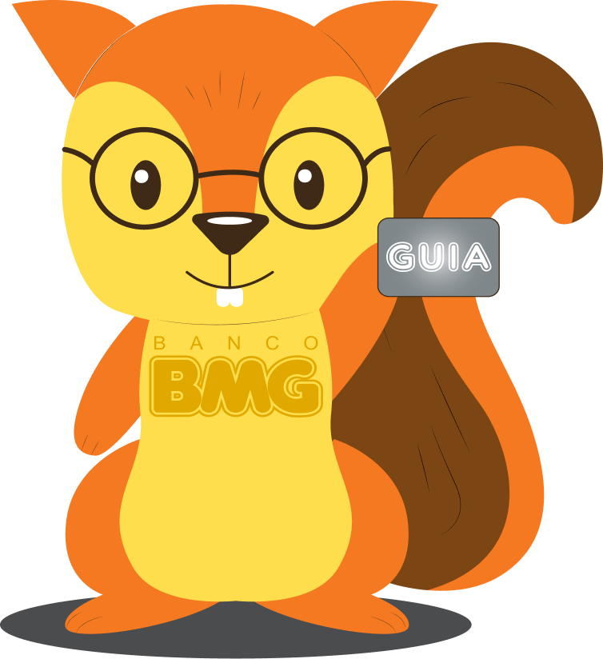
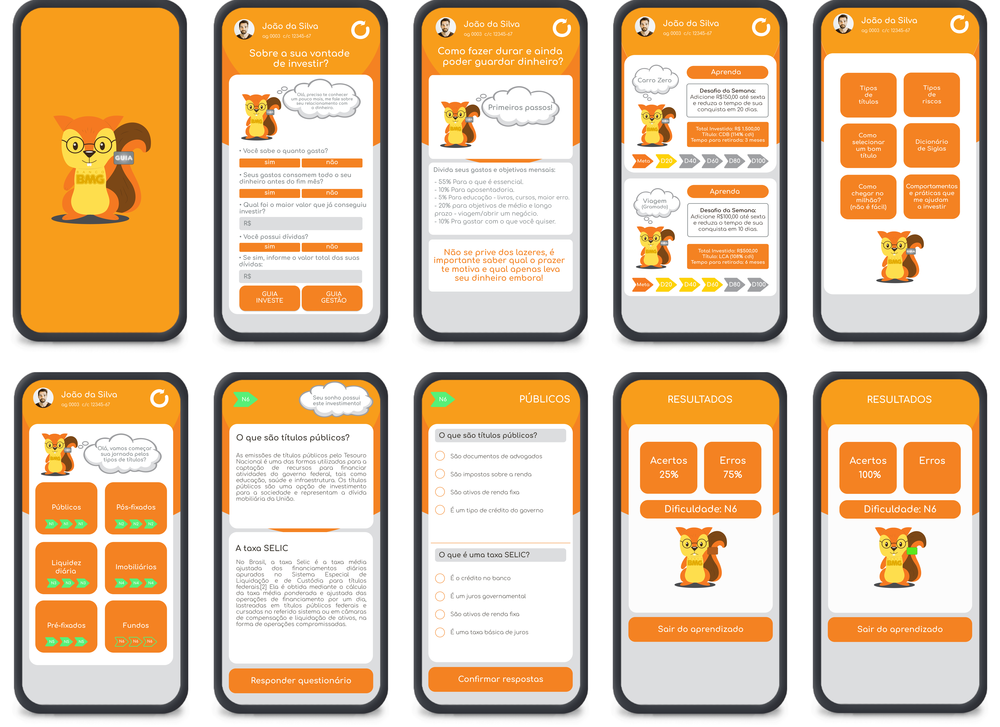

# BMG GUIA - Gestão Unificada

Aplicativo MVP desenvolvido com React Native para guiar usuários do app meu_MBG a investir, controlar e aprender sobre suas finanças.

  

## :pushpin: Sobre o projeto

Desenvolvemos a plataforma GUIA, uma seção no App Meu BMG responsável por ensinar ao usuário de maneira prática sobre investimentos e a gestão de suas finanças. Nosso Mascote GUI é nosso guia nessa jornada, sendo uma referência aos cofrinhos de esquilo distribuídos pelas cadernetas de poupança do BMG em seu ano de lançamento.

  

## :running: Running

  

## :question: Por que?

Este projeto foi desenvolvido com a proposta de ser um produto mínimo viável (MVP) para o [Hackaton BMG](https://www.hackathonbmg.com.br/) (28/05 a 03/06 de 2020) que tem o seguinte desafio:

> _Como podemos apoiar nossos clientes ensinando o básico sobre educação financeira? Como apoiar no planejamento doméstico e ajudar essas pessoas a realizar ainda mais sonhos? Conquistar a confiança e apresentar opções de investimento que se encaixem no perfil de cada um? Queremos ajudar pessoas de diferentes perfis a mudarem de hábitos para gerir, poupar e economizar, e investir seu dinheiro utilizando o Meu BMG._

## :rocket: Tecnologias

- React Native
- React Navigation
- TypeScript
- Expo

---

## Desenvolvido com :heartbeat: por

<table>
  <tr>
    <td align="center">
      <a href="">
        
         
        <b>Thalyson Rodrigues</b> 
        Developer/Engineer
      </a>
    </td>
    <td align="center">
      <a href="">
        
         
        <b>João Kléber</b> 
        Developer/Engineer
      </a>
    </td>
    <td align="center">
      <a href="">
        
         
        <b>Manuela Luz</b> 
        UX|Design/Marketing
      </a>
    </td>
    <td align="center">
      <a href="">
        
         
        <b>Paulo Victor</b> 
        Business/Marketing
      </a>
    </td>
  </tr>
</table>
